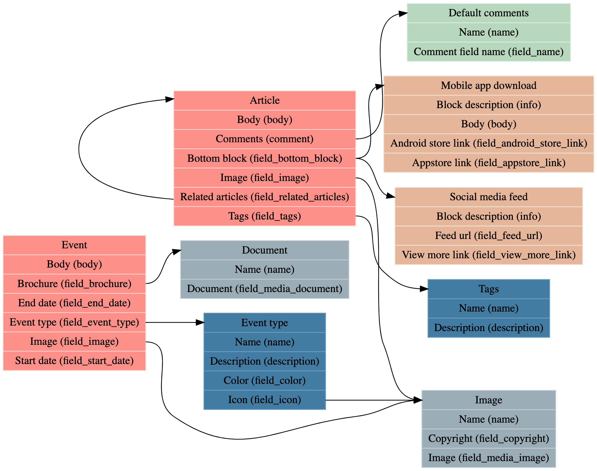

# Entity type explorer

## Purpose
Analyse the content structure of a Drupal site by providing a quick overview of
the content types, their fields and relations. The result is a link to an
online Graphviz visualizer.

## Installation
This script does not require any specific installation. Just download the file
and run it from the command line using `drush php:script entity-type-explorer`.

## Usage
Out of the box, the script is restricting the analysis to the following entity
types:
- Block content
- Comment
- Media
- Node
- Taxonomy
- Paragraph

You can change this list by editing the `$entity_types` variable in the script.
